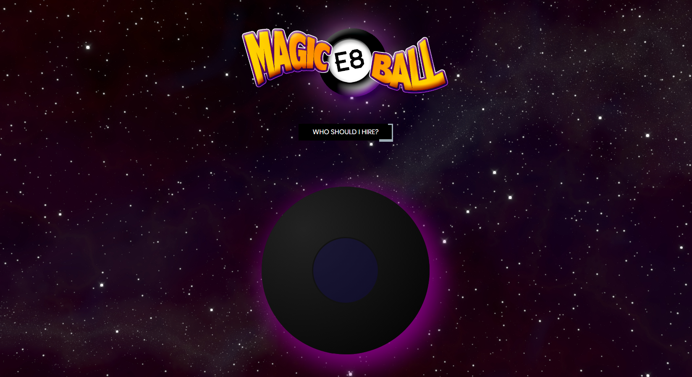
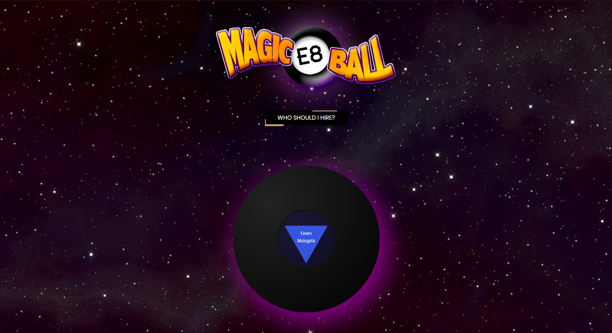

# Magic E8 Ball

This is my implementation of a simple magic 8 ball web app. The purpose is to provide sensible candidates for junior developer roles to potential hiring managers. Using a complex algorithm the Magic E8 Ball will present the user with the perfect candidate from Nashville Software School’s evening cohort 08. The user can then click on the presented candidate’s name, and be directed to his or her corresponding LinkedIn profile.

Current deployed build: [link]( https://magic-e8-ball.firebaseapp.com/)

## Screenshots

## Technologies Used
* React
* Sass
* Axios
* Create-React-App
* Reactstrap

## How to run this app
Note: To run this app you will need a firebase account and a new project.

### 1. Configure Firebase
1. Clone the repository to your local machine.
2. Run the following command in terminal to download the web dependencies: `npm install`
3. In the db folder, rename apiKeys.json.example to apiKeys.json.
4. In Firebase, create a new project.
5. Navigate to your config object, and copy the keys from Firebase into the apiKeys.json file.
6. Create a realtime database in Firebase, and start in test mode.
7. Navigate to the Data tab inside the realtime database, and import cohort.json.

### 2. Serve up the app
#### `npm start`

Runs the app in the development mode. 
Open [http://localhost:3000](http://localhost:3000) to view it in the browser.

## Acknowledgements
[Jonathan Mohan](https://github.com/JonathanPMohan) provided the logo for the header.
